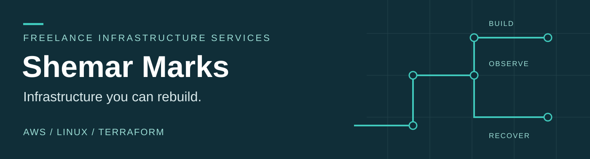

  

## Infrastructure, with a recovery plan

I'm **Shemar Marks**. I offer freelance help with AWS deployments, Linux systems, infrastructure automation, monitoring and recovery planning.

My focus is practical: understand the workload, make the setup repeatable, test the recovery path and leave clear documentation.

**[Portfolio](https://shemar-marks.marks-shemarhn.chatgpt.site)** · **[LinkedIn](https://www.linkedin.com/in/shemar-marks-11ba4820b/)** · **[Project enquiries](mailto:shemarmarks.tech@gmail.com)**

 

### What I can help with

| Need | Work we can scope together |
| :--- | :--- |
| A repeatable deployment | AWS and Linux setup, Terraform configuration, migration planning and a documented handover. |
| A useful alert | Application-health checks, CloudWatch metrics, SNS notifications and operational runbooks. |
| A tested recovery path | Backup and restore workflows, recovery exercises, integrity checks and recorded results. |

### Featured infrastructure case study

**[Northstar Repairs — Proxmox migration & AWS recovery](https://github.com/Shemarhn/northstar-aws-recovery)**

A completed portfolio lab for a synthetic repair shop: migrate a Python/SQLite application from Proxmox to AWS, rebuild the EC2 server, restore its S3 backup and verify the recovered application.

| Recovery exercise | Observed result |
| :--- | :--- |
| Recovery time | **12 minutes**, measured by the operator in one exercise against a 30-minute design target. |
| Restored data | **All six validation jobs**, including `DR-TEST`; SQLite integrity check `ok`. |
| Monitoring | Application-health alarm tested; CloudWatch/SNS `ALARM` and `OK` emails delivered. |
| Closeout | AWS lab destroyed after evidence preservation; no active Northstar resources found in the cleanup checks. |

**[Read the case study](https://github.com/Shemarhn/northstar-aws-recovery/blob/main/docs/CASE-STUDY.md)** · **[View the evidence](https://github.com/Shemarhn/northstar-aws-recovery/tree/main/evidence)** · **[Download the presentation](https://github.com/Shemarhn/northstar-aws-recovery/raw/refs/heads/main/docs/presentation/Northstar-Repairs-Case-Study.pptx)**

This was a lab exercise with synthetic data. The recorded recovery time is a single observed result; it does not establish a production SLA or a measured RPO.

### Tools used in the infrastructure work

**AWS** — EC2, IAM, Systems Manager, S3, CloudWatch, SNS  
**Systems & automation** — Linux, Proxmox, Terraform, Bash, Python, Git  
**Workload & verification** — SQLite, health checks, backup scripts, restore runbooks, integrity checks

### Software projects

- **[GitHub Ranked](https://github.com/Shemarhn/Github_Ranked)** — A Next.js/TypeScript application that turns GitHub contribution data into a ranking dashboard and embeddable badges. Uses the GitHub GraphQL API, Satori and Redis caching.
- **[ClearLedger](https://github.com/Shemarhn/ClearLedger)** — A Flutter personal-finance app project with receipt and text parsing, a FastAPI backend and Supabase. See the repository for implementation details.

### Start a conversation

Tell me what you're running, what needs to change and how you want to measure success. We can define the scope and the handover from there.

**[shemarmarks.tech@gmail.com](mailto:shemarmarks.tech@gmail.com)** · **[LinkedIn](https://www.linkedin.com/in/shemar-marks-11ba4820b/)** · **[Portfolio & case studies](https://shemar-marks.marks-shemarhn.chatgpt.site)**
